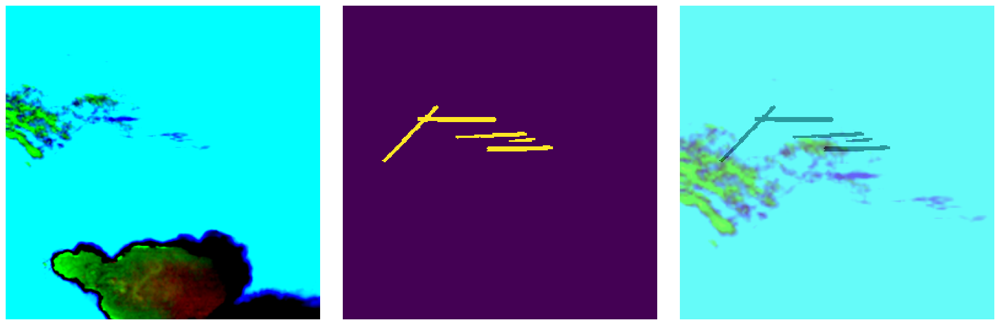
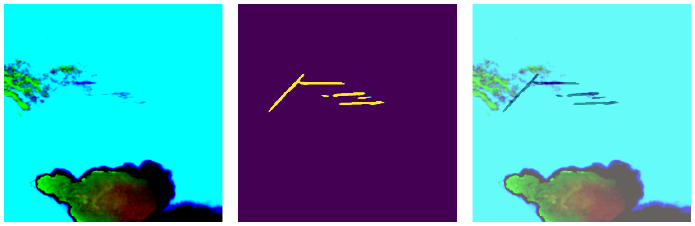
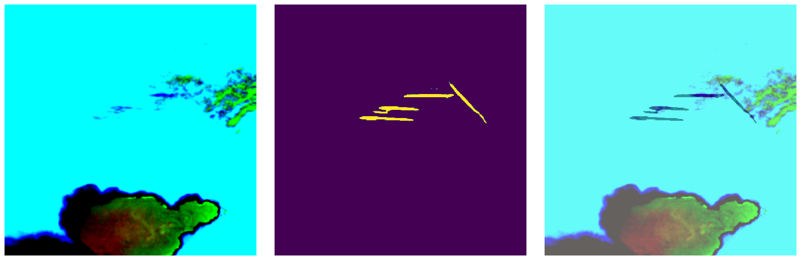
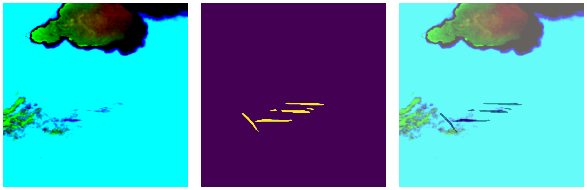
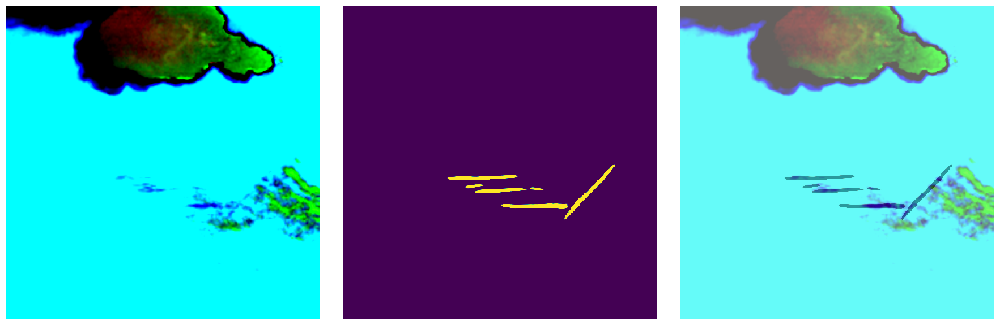
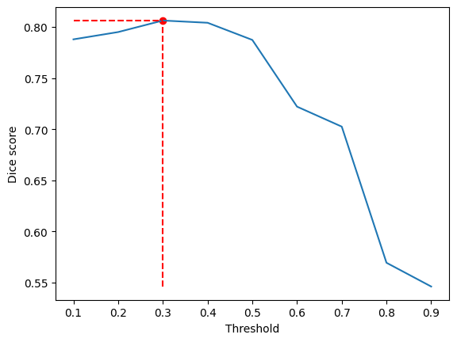
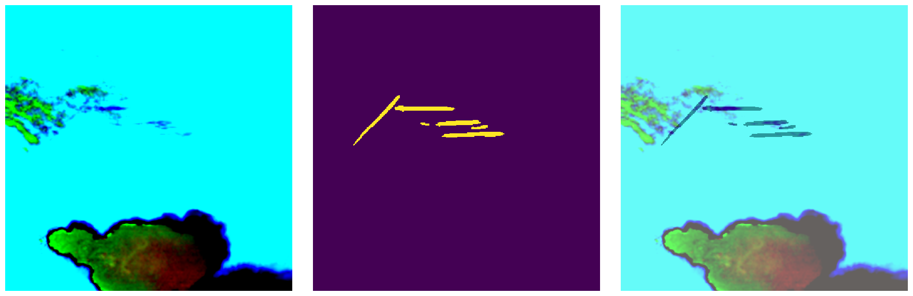
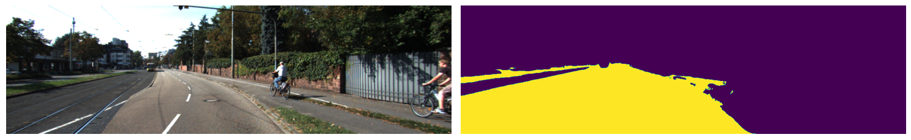
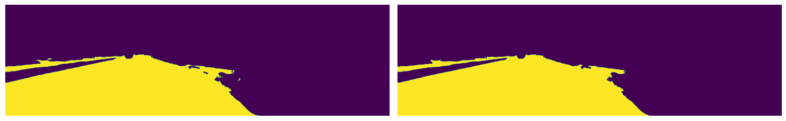

When a machine learning model is trained, a question that naturally comes up is how to do better. One can try to improve the model itself by changing its architecture, tuning hyperparameters, or sophisticating input preprocessing routines. But is there something that can be done with predictions themselves, leaving other parts of the pipeline intact?

Post-processing in general refers to a set of techniques that refine predictions obtained from the model. For example, one works on an image segmentation task, and the model predicts a mask with a lot of noise. In this case, one can use a noise threshold to get filter out values that are below it, obtaining a more accurate result. Or one needs to reformat the model's output to another format accepted by the task. In this article, I will introduce four post-processing techniques using that task of image segmentation as an example.

Table of Contents:

- [Test-time augmentation (TTA)](#test-time-augmentation-tta)
- [Pseudo-labeling](#pseudo-labeling)
- [Domain-specific post-processing](#domain-specific-post-processing)
- [Conditional random fields (CRF)](#conditional-random-fields-crf)
- [Conclusion](#conclusion)

## Test-time augmentation (TTA)

TTA is a technique applied during the inference stage. It involves transforming input image in a handful of ways, running the model in each transformed sample, and averaging results after reverting the transformations applied. It is used for improving results at the inference stage at a cost of increased runtime.

Consider the problem of identifying condensation trails (contrails) from satellite images. The task is to predict a binary mask of contrails which are line fragments subject to additional constraints.

One sample from the dataset is shown on Fig. 1:

<figure>

<figcaption align = "center"><b>Fig. 1 - Contrails sample</b></figcaption>
</figure>

With a standard inference routine, we get the following result (Fig. 2):

<figure>

<figcaption align = "center"><b>Fig. 2 - Contrails prediction</b></figcaption>
</figure>

, with a score of 0.6893. Now, we apply the following transformations to the input image:

- horizontal flip
- vertical flip
- both flips

and obtain predictions shown below (Fig. 3):

<figure>

</figure>
<figure>

</figure>
<figure>

<figcaption align = "center"><b>Fig. 3 - From left to right: input image, predicted mask, overlay of the image and the mask. From top to bottom: horizontal flip, vertical flip, both flips.</b></figcaption>
</figure>

Just as with standard prediction, we need to find a confidence threshold. Values above the threshold are considered to be contrails.

```python
scores= []
thresholds = np.arange(0.1, 1, 0.1)
for thresh in thresholds:
    mean_tta_pred = torch.mean(torch.stack(tta_preds), dim=0) > thresh
    score = loss_utils.dice_global(mean_tta_pred, gt_mask)
    scores.append(score)
best_thresh = thresholds[np.argmax(scores)]
```

We iterate over a range of thresholds and choose the one that gives the best Dice score. The table below shows the Dice score for each threshold.

| Threshold | Dice score |
|-----------|------------|
| 0.1       | 0.7879     |
| 0.2       | 0.7950     |
| 0.3       | 0.8063     |
| 0.4       | 0.8041     |
| 0.5       | 0.7873     |
| 0.6       | 0.7221     |
| 0.7       | 0.7026     |
| 0.8       | 0.5695     |
| 0.9       | 0.5462     |

And the corresponding plot (Fig. 4):

<figure>
<p style="text-align:center;"></p>
<figcaption align = "center"><b>Fig. 4 - Dice score vs threshold</b></figcaption>
</figure>

Finally, we average the results using the threshold:

```python
tta_pred = torch.mean(torch.stack(tta_preds), dim=0)
tta_mask = (tta_pred > best_thresh).int()
```

to get the following result (Fig. 5):

<figure>

<figcaption align = "center"><b>Fig. 5 - Final contrails mask with TTA</b></figcaption>
</figure>

Compared to the standard prediction, quantitatively we get 0.117 increase in Dice score: 0.8063 vs 0.6893.

Runtime increases linearly with the number of transformations with additional overhead for applying each transformation.
Using the `%%timeit` magic command in a Jupyter notebook, we get the following results for vanilla inference:

```python
%%timeit
with torch.no_grad():
    predicted_mask = model(images)
```

`8.19 ms ± 79.9 µs per loop (mean ± std. dev. of 7 runs, 100 loops each)`

And with test augmentations:

```python
import torchvision as tv

transforms = [
    lambda x: x,
    lambda x: tv.transforms.Compose([tv.transforms.RandomHorizontalFlip(p=1)])(x),
    lambda x: tv.transforms.Compose([tv.transforms.RandomVerticalFlip(p=1)])(x),
    lambda x: tv.transforms.Compose(
        [tv.transforms.RandomHorizontalFlip(p=1), tv.transforms.RandomVerticalFlip(p=1)]
    )(x),
]
```

```python
%%timeit
tta_preds=[]
# in case of flips, reverse transforms are the same as transforms
reverse_transforms = transforms
for transform, reverse_transform in zip(transforms, reverse_transforms):
    transformed_images = torch.stack([transform(image) for image in images])
    with torch.no_grad():
        predicted_mask = model(transformed_images)
    tta_preds.append(reverse_transform(predicted_mask))
```

`32.7 ms ± 410 µs per loop (mean ± std. dev. of 7 runs, 10 loops each)`

Keep in mind that TTA can worsen the results if transformed images are out of the distribution of the training dataset. For example,
applying pixel intensity transformations to a dataset of medical images may lead to unrealistic samples that the model has never seen before.

## Pseudo-labeling

While TTA is used at the final stage of the pipeline, pseudo-labeling is an intermediate step between multiple runs of the training pipeline. This technique contrasts with others presented in this article in that it improves model's results indirectly by adding more data to the training dataset.
The following steps describe the algorithm:

1. Train the model on the labeled (train) dataset.
2. Run inference on the unlabeled (test) dataset.
3. If it's not the first pipeline run, has metrics improved compared to the previous run? If not, stop.
4. Filter out predictions from step 3 that have low confidence.
5. Add the rest of the predictions - pairs (input, prediction) - to the train dataset.
6. Go to step 1.

The step I want to additionally discuss is step 4. How do we filter out predictions with low confidence? In image classification one
works with probabilities directly, and it is trivial to set a confidence threshold. In semantic image segmentation the output is a mask where
every pixel ranges from 0 to 1, answering the question "how likely is this pixel to belong to the class?". To understand if the prediction is
confident enough, we can consider pixels with values above a certain threshold and take an average. If the average is above a second threshold,
we bring the sample into the train dataset.

## Domain-specific post-processing

This type of post-processing is applicable to those tasks where the modeled object must have certain properties. For example, in the task of
contrail segmentation we touched on earlier, the object must be a line fragment to which the following rules apply:

- Contrails must contain at least 10 pixels
- At some time in their life, Contrails must be at least 3x longer than they are wide
- Contrails must either appear suddenly or enter from the sides of the image
- Contrails should be visible in at least two images of the same location

With the help of OpenCV toolkit, e.g., LineSegmentDetector, applied to predicted contrail masks, we can discard masks that do not meet the
criteria (i.e., no mask is better than an incomplete mask). But this requires careful tuning of additional parameters and adds runtime overhead.

## Conditional random fields (CRF)

CRF in its original formulation is a probabilistic graphical model that can be used for image segmentation. The idea is to model the
conditional probability of a pixel belonging to a class given the observed values of its neighbors that we have from the initial prediction.
Like the TTA technique, CRF in this form is used at the inference stage.

However, there is a way to incorporate CRF into the training pipeline. The idea is to add a CRF network to the model and train it end-to-end.
The architecture of the CRF network is RNN-based and originates from the [CRF-RNN paper](https://github.com/torrvision/crfasrnn).

As an example, consider the task of segmenting the class 'road' from the [KITTI dataset](https://www.cvlibs.net/datasets/kitti/). A sample input and prediction from the model are shown on Fig. 6:

<figure>

<figcaption align = "center"><b>Fig. 6 - KITTI prediction</b></figcaption>
</figure>

With a credit to [this Kaggle notebook](https://www.kaggle.com/code/meaninglesslives/apply-crf), we postprocess the prediction
with the following code:

```python
n_labels = 2
# Setting up the CRF model
d = dcrf.DenseCRF2D(original_image.shape[1], original_image.shape[0], n_labels)

# get unary potentials (neg log probability)
U = unary_from_labels(labels, n_labels, gt_prob=0.8, zero_unsure=False)
d.setUnaryEnergy(U)

# This adds the color-independent term, features are the locations only.
d.addPairwiseGaussian(sxy=(3, 3), compat=3, kernel=dcrf.DIAG_KERNEL, normalization=dcrf.NORMALIZE_SYMMETRIC)
    
# Run Inference for 10 steps
inference_steps = 10
Q = d.inference(inference_steps)

# Find out the most probable class for each pixel.
MAP = np.argmax(Q, axis=0)

refined_prediction = MAP.reshape((original_image.shape[0],original_image.shape[1]))
```

Note the following parameters:

- `gt_prob`, confidence in the original prediction
- `sxy`, standard deviation for the location component
- `compat`, label compatibilities, e.g., how bad it is to mistake one class for another
- `inference_steps`, number of iterations of [MAP inference](https://en.wikipedia.org/wiki/Maximum_a_posteriori_estimation)

After applying CRF with the parameters from above, we get the following (Fig. 7):

<figure>

<figcaption align = "center"><b>Fig. 7 - KITTI prediction with CRF. (Left) original prediction, (right) prediction refined with CRF</b></figcaption>
</figure>

Mean absolute difference between the original prediction and the prediction refined with CRF is ~370 with pixels ranging from 0 to 255. With given configuration,
CRF just removed some noise around the edges of the road.

## Conclusion

We discussed four techniques that can be used to improve the quality and integrity of the model's predictions. Although we used image
segmentation for examples, these techniques can be applied to a wide range of perception tasks. The list of techniques is not exhaustive, and other methods like [morphological transformations](https://opencv24-python-tutorials.readthedocs.io/en/latest/py_tutorials/py_imgproc/py_morphological_ops/py_morphological_ops.html) may require reader's attention.

Test-time augmentation and Conditional Random Fields can be used to refine the predictions at the (final) inference stage. Pseudo-labeling allows
to increase the size of the training dataset by iteratively picking the most confident predictions from the unlabeled dataset. Domain-specific
post-processing can discard predictions that do not meet properties of the modeled object.

However, the success with using the aforementioned techniques comes with a careful selection of hyperparameters and a lot of experimentation.
